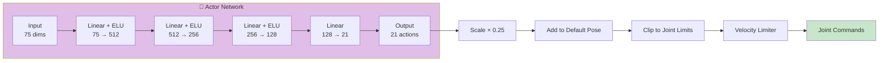
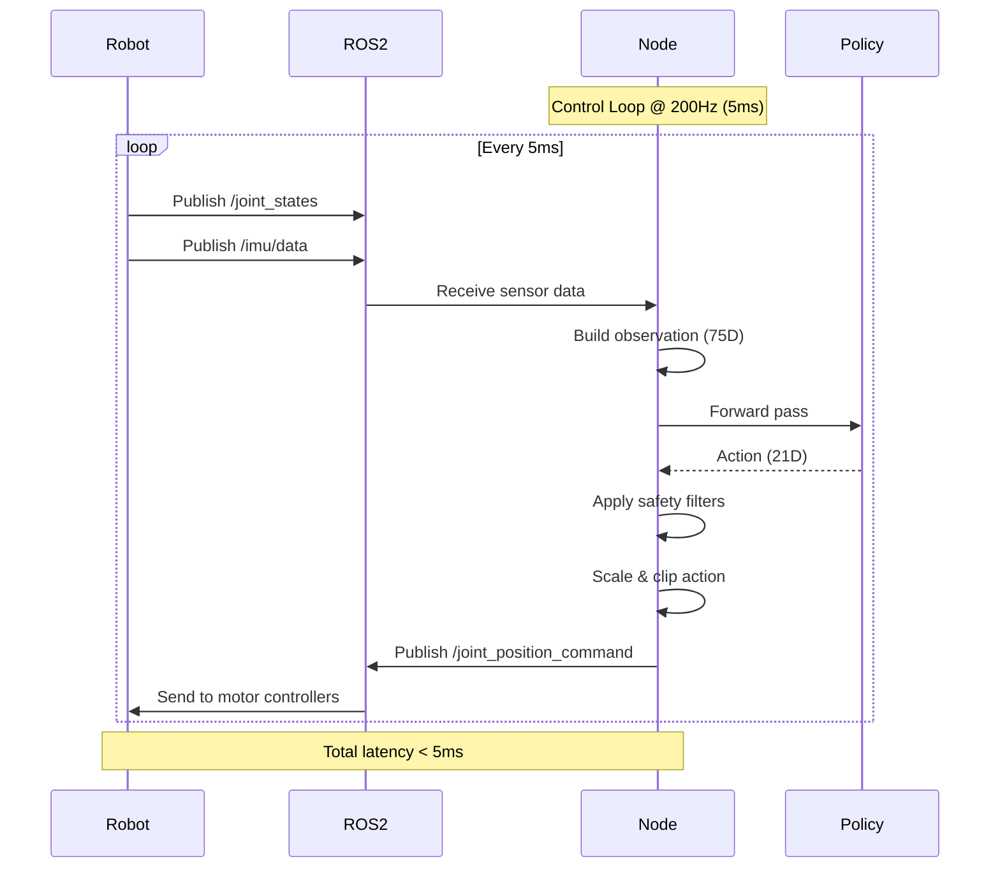
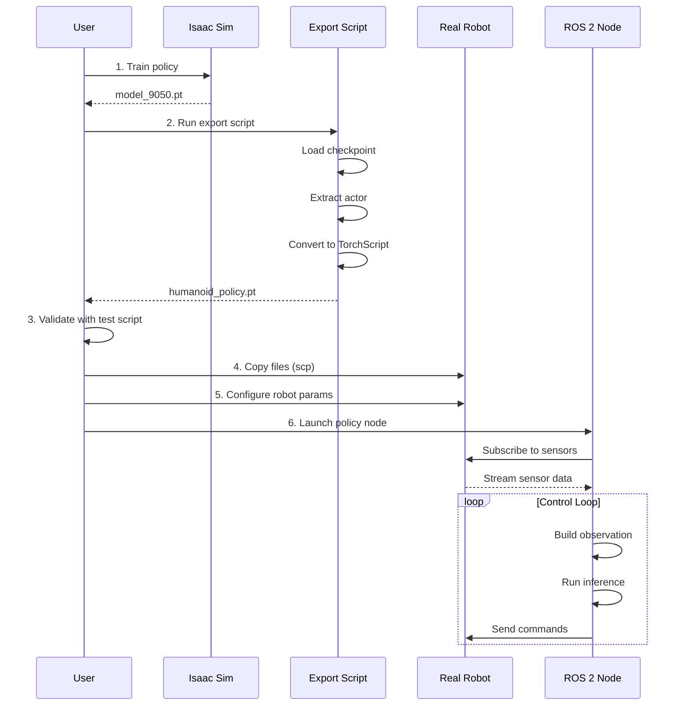
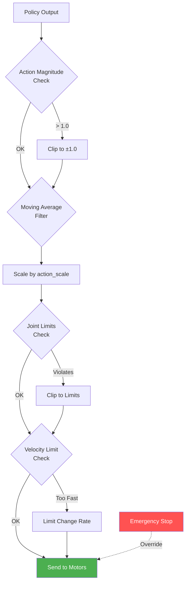
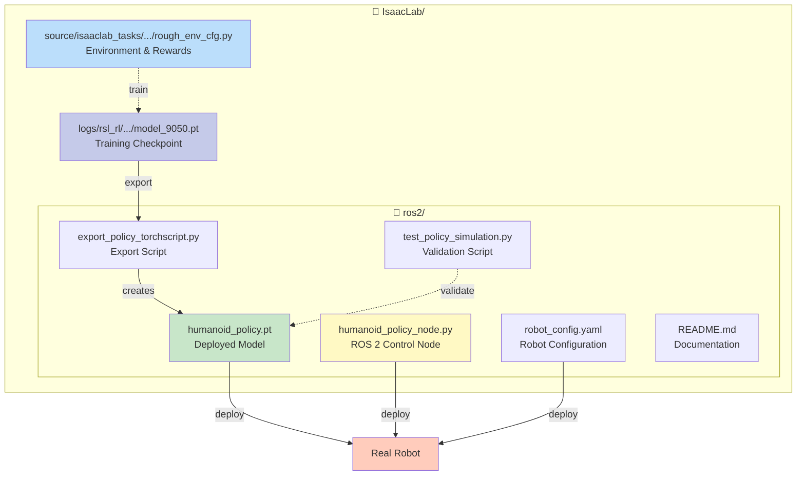
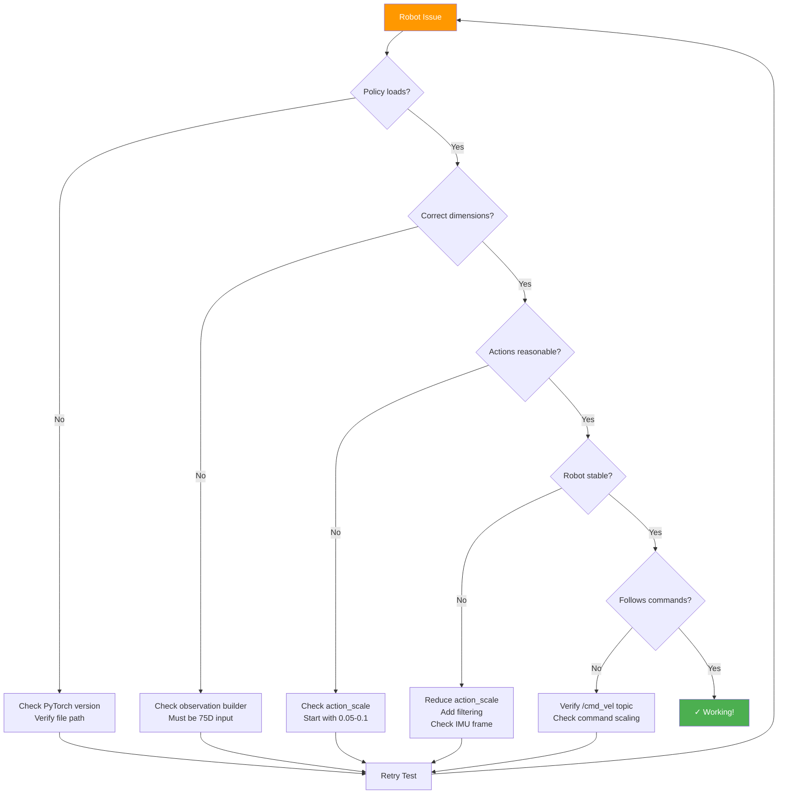

# Humanoid Robot Training & Deployment Workflow

## Complete System Architecture

```mermaid
flowchart TB
    subgraph Training["🎓 Phase 1: Training in Isaac Sim"]
        A1[Configure Robot<br/>HUMANOID_10102025_CFG] --> A2[Configure Environment<br/>rough_env_cfg.py]
        A2 --> A3[Tune Rewards<br/>stability + walking]
        A3 --> A4[Train with RSL-RL<br/>PPO Algorithm]
        A4 --> A5[Monitor Progress<br/>TensorBoard]
        A5 --> A6{Good Performance?}
        A6 -->|No| A3
        A6 -->|Yes| A7[Save Checkpoint<br/>model_9050.pt]
    end
    
    subgraph Export["📦 Phase 2: Policy Export"]
        B1[Load Checkpoint<br/>model_9050.pt] --> B2[Extract Actor Network<br/>75→512→256→128→21]
        B2 --> B3[Convert to TorchScript<br/>torch.jit.script]
        B3 --> B4[Embed Metadata<br/>obs_dim=75, action_dim=21]
        B4 --> B5[Save Deployment Model<br/>humanoid_policy.pt]
    end
    
    subgraph Validate["✅ Phase 3: Validation"]
        C1[Test Policy Loading<br/>torch.jit.load] --> C2[Verify Dimensions<br/>input=75, output=21]
        C2 --> C3[Run Simulation Test<br/>test_policy_simulation.py]
        C3 --> C4{Actions Valid?}
        C4 -->|No| Export
        C4 -->|Yes| C5[Ready for Deployment]
    end
    
    subgraph Deploy["🤖 Phase 4: Real Robot Deployment"]
        D1[Configure Robot<br/>joint names, limits, defaults] --> D2[Copy Files to Robot<br/>policy.pt + node.py]
        D2 --> D3[Install Dependencies<br/>PyTorch, ROS 2]
        D3 --> D4[Launch ROS 2 Node<br/>humanoid_policy_node]
        D4 --> D5[Subscribe to Sensors<br/>joints + IMU]
        D5 --> D6[Build Observations<br/>75 dimensions]
        D6 --> D7[Run Policy Inference<br/>@200Hz]
        D7 --> D8[Publish Joint Commands<br/>21 positions]
        D8 --> D9{Safe Operation?}
        D9 -->|No| D10[Emergency Stop]
        D9 -->|Yes| D11[Continue Control]
        D11 --> D5
    end
    
    A7 --> B1
    B5 --> C1
    C5 --> D1
    D10 --> D12[Adjust Parameters<br/>action_scale, filters]
    D12 --> D4
    
    style Training fill:#e1f5ff
    style Export fill:#fff4e1
    style Validate fill:#e8f5e9
    style Deploy fill:#fce4ec
```



## Data Flow Architecture

```mermaid
graph LR
    subgraph Robot["🤖 Real Robot Hardware"]
        J[Joint Encoders<br/>21 positions + velocities] 
        I[IMU Sensor<br/>acceleration + gyroscope]
        M[Motor Controllers<br/>21 actuators]
    end
    
    subgraph ROS2["🔄 ROS 2 Middleware"]
        JS[/joint_states<br/>sensor_msgs/JointState]
        IMU[/imu/data<br/>sensor_msgs/Imu]
        CMD[/joint_position_command<br/>Float32MultiArray]
        VEL[/cmd_vel<br/>geometry_msgs/Twist]
    end
    
    subgraph Node["🧠 Policy Node"]
        OB[Observation Builder<br/>75 dimensions]
        POL[Policy Network<br/>TorchScript]
        ACT[Action Processor<br/>safety + scaling]
    end
    
    J -->|publish| JS
    I -->|publish| IMU
    JS --> OB
    IMU --> OB
    VEL -->|user commands| OB
    
    OB -->|obs_tensor| POL
    POL -->|action_tensor| ACT
    ACT -->|publish| CMD
    CMD -->|subscribe| M
    
    style Robot fill:#ffebee
    style ROS2 fill:#e3f2fd
    style Node fill:#f3e5f5
```

## Observation Structure (75 Dimensions)

```mermaid
graph TD
    subgraph Obs["📊 Observation Vector [75]"]
        O1[1-3: Base Linear Velocity<br/>vx, vy, vz]
        O2[4-6: Base Angular Velocity<br/>ωx, ωy, ωz]
        O3[7-9: Projected Gravity<br/>gx, gy, gz normalized]
        O4[10-12: Velocity Commands<br/>cmd_vx, cmd_vy, cmd_ω]
        O5[13-33: Joint Positions Relative<br/>pos - default_pos]
        O6[34-54: Joint Velocities<br/>21 joint velocities]
        O7[55-75: Previous Actions<br/>last policy output]
    end
    
    JS[/joint_states] --> O5
    JS --> O6
    IMU[/imu/data] --> O2
    IMU --> O3
    VEL[/cmd_vel] --> O4
    HIST[Action History] --> O7
    
    O1 & O2 & O3 & O4 & O5 & O6 & O7 --> POL[Policy Network]
    
    style Obs fill:#fff9c4
```

## Policy Network Architecture



## Control Loop Timing



## Deployment Sequence



## Safety System



## File Structure



## Troubleshooting Flow



